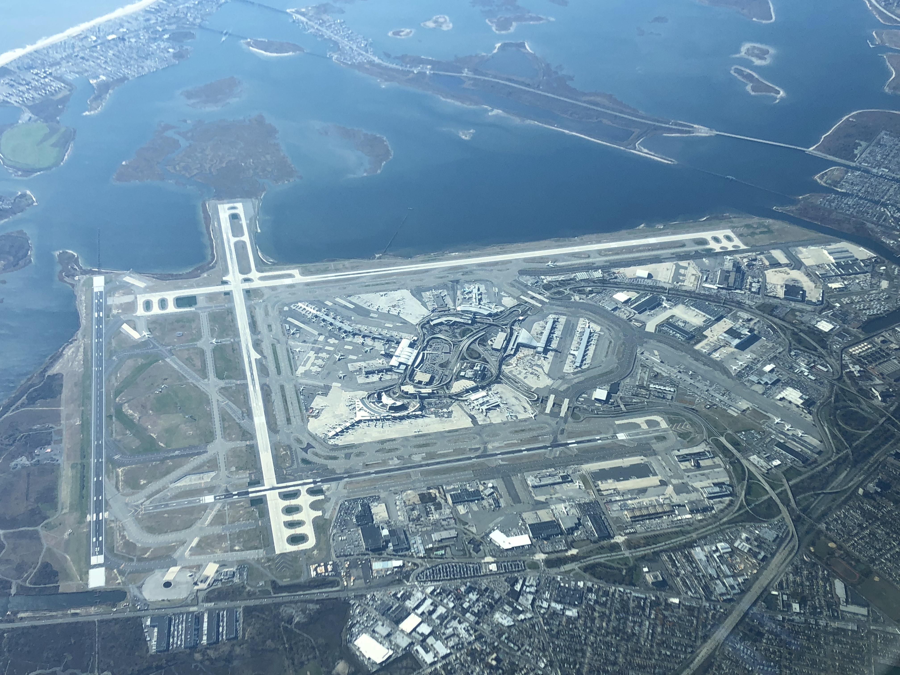

# flights-analysis
# nycflight23 ✈️

## Introduction
The nycflight23 dataset is a <u>rich</u> collection of flight records from New York City in the year 2023. It provides detailed information about departures, arrivals, delays, airlines, and airports, making it an excellent resource for data analysis, visualization, and machine learning projects.

This dataset is inspired by the well-known nycflights13 package but updated to reflect more recent flight data. It is designed to help learners, educators, and researchers explore real-world aviation data while practicing skills in data wrangling, exploratory analysis, and statistical modeling. 

The objective of this analysis is to identify patterns in flight delays, airline performance, and travel trends using data analysis techniques.

Understanding these patterns can help airlines improve operational efficiency and help passengers make better travel decisions.

## Key Features
- 📊 Over `300,000` flight records from NYC airports (**JFK, LGA, EWR**) in *2023*

- 🛫 Variables include `departure/arrival times, delays, flight numbers, tail numbers, and destinations`

* 🏢 Linked tables for airlines, airports, planes, and weather conditions

* 🔗 Easy integration with R, Python, and SQL workflows

## Use Cases
- Teaching data science and statistics with a realistic dataset

- Practicing data cleaning and transformation techniques

- Building predictive models for flight delays

The link to the original project dataset is available [here](https://github.com/AdewoyeTimilehin/new-york-flight-analysis).

## 📊 Dataset Description

The dataset used in this project is the **NYC Flights 2013 dataset**, which contains information about all flights that departed from New York City airports in 2013.

### Airports Included
- John F. Kennedy International Airport (JFK)
- LaGuardia Airport (LGA)
- Newark Liberty International Airport (EWR)

## Dataset Description
The dataset contains several tables:
| datasets | description |
|----------|-------------|
| `airlines.csv` | Airline carrier names and codes  |
|`airports.csv`| Airport details and metadata |
|`flights.csv`| Information about each flight departure and arrival |
|`Planes.csv`| Aircraft information |
|`weather.csv`| Hourly weather conditions at airports |

## 🧾 Key Variables in the Flights Dataset

| Variable | Description |
|--------|-------------|
| year | Year of the flight |
| month | Month of the flight |
| day | Day of the flight |
| dep_time | Actual departure time |
| sched_dep_time | Scheduled departure time |
| dep_delay | Departure delay (minutes) |
| arr_time | Actual arrival time |
| arr_delay | Arrival delay (minutes) |
| carrier | Airline carrier code |
| flight | Flight number |
| tailnum | Aircraft tail number |
| origin | Departure airport |
| dest | Destination airport |
| air_time | Time spent in the air |
| distance | Distance between airports |

## 🛠 Tools and Technologies

The following tools and technologies were used in this project:

- **Postgres SQL**
- **POWER BI**

## 📊 Key Insights

From the analysis, several patterns were observed:

- Early morning flights generally experience fewer delays.
- Delays increase later in the day due to accumulated operational issues.
- Some airlines consistently perform better in terms of on-time arrivals.
- Weather conditions play an important role in flight delays.
- Certain months experience higher flight activity due to seasonal travel demand.

---

## 🚀 Future Improvements

Further work could include:

- Building machine learning models to predict flight delays
- Creating an interactive dashboard for flight performance analysis
- Performing deeper weather impact analysis
- Comparing airline performance over multiple years

---

## 📚 References

- NYC Flights 2023 Dataset
- SQL Data Analysis Libraries Documentation
- Airline Industry Delay Statistics

---

## 👤 Author

**Adewoye Oluwatimilehin**

Data Analytics Project – Flight Delay Analysis